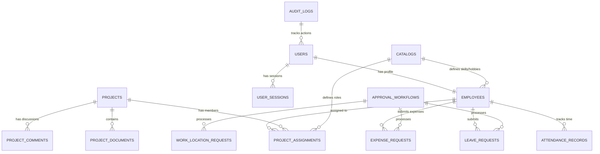

# Database Architecture & Storage Strategy (MongoDB, S3)

## 1. Executive Summary

This document defines the comprehensive database architecture and storage strategy for the Project Management Software (PMS), designed to support enterprise-scale operations with high performance, reliability, and scalability. The architecture leverages MongoDB for flexible document storage and S3-compatible storage for file management.

### 1.1 Architectural Principles

#### Data Modeling Philosophy
* **Document-Oriented Design**: Leverage MongoDB's document model for complex, nested data structures
* **Reference-Based Relationships**: Use ObjectId references between collections for data integrity and flexibility
* **Selective Embedding**: Embed small, immutable subdocuments only when it significantly improves read performance
* **Schema Evolution**: Design for schema flexibility while maintaining data consistency
* **Audit-First Approach**: Comprehensive audit trails for all sensitive operations and data changes

#### Performance & Scalability Principles
* **Read Optimization**: Optimize for read-heavy workloads with strategic indexing and data denormalization
* **Write Efficiency**: Batch operations and efficient update patterns for high-throughput scenarios
* **Horizontal Scaling**: Design for MongoDB sharding and replica set deployment
* **Cache-Friendly Design**: Structure data to support effective caching strategies
* **Query Performance**: Optimize query patterns and index strategies for sub-second response times

#### Data Integrity & Consistency
* **ACID Transactions**: Use MongoDB transactions for multi-document operations requiring consistency
* **Referential Integrity**: Implement application-level referential integrity checks
* **Data Validation**: Schema-level validation with MongoDB JSON Schema
* **Soft Deletes**: Logical deletion for critical business data with audit trails
* **Temporal Data Management**: UTC storage with timezone-aware application rendering

### 1.2 Technology Stack Decisions

#### MongoDB 7.0+ Features
* **Multi-Document Transactions**: ACID compliance for complex business operations
* **Change Streams**: Real-time data change notifications for reactive applications
* **Aggregation Framework**: Powerful data processing and analytics capabilities
* **GridFS**: Large file storage within MongoDB for metadata-rich files
* **Time Series Collections**: Optimized storage for time-based data (attendance, metrics)

#### S3-Compatible Storage
* **MinIO (Development)**: Local S3-compatible storage for development environments
* **AWS S3 (Production)**: Enterprise-grade object storage with global CDN integration
* **Versioning**: File versioning for document management and audit requirements
* **Lifecycle Management**: Automated data archival and cost optimization
* **Security**: Encryption at rest and in transit with fine-grained access controls

## 2. Database Schema Design & Entity Relationships

### 2.1 Core Entity Relationship Model



### 2.2 Detailed Collection Schemas

#### User Management Collections

##### `users` - Core User Authentication & Authorization
```typescript
interface User {
  _id: ObjectId;
  email: string;                    // Unique email address
  passwordHash: string;             // Argon2 hashed password
  status: 'active' | 'archived' | 'suspended';
  roles: UserRole[];               // Array of assigned roles

  // Security & Session Management
  lastLoginAt?: Date;
  passwordChangedAt?: Date;
  failedLoginAttempts: number;
  lockedUntil?: Date;

  // Multi-factor Authentication
  mfaEnabled: boolean;
  mfaSecret?: string;
  backupCodes?: string[];

  // Audit Fields
  createdAt: Date;
  updatedAt: Date;
  createdBy?: ObjectId;           // Admin who created the account
}

type UserRole = 'employee' | 'manager' | 'hr' | 'director' | 'finance' | 'ceo' | 'admin';
```

##### `user_sessions` - Session Management
```typescript
interface UserSession {
  _id: ObjectId;
  userId: ObjectId;               // Reference to users collection
  refreshToken: string;           // Hashed refresh token
  deviceInfo: {
    userAgent: string;
    ip: string;
    location?: string;
    deviceType: 'desktop' | 'mobile' | 'tablet';
  };

  // Session Lifecycle
  createdAt: Date;
  lastAccessedAt: Date;
  expiresAt: Date;
  revokedAt?: Date;
  revokedReason?: string;
}
```

##### `employees` - Employee Profile & Professional Information
```typescript
interface Employee {
  _id: ObjectId;
  userId: ObjectId;               // Reference to users collection

  // Personal Information
  name: string;
  designation: string;
  employeeId?: string;            // Optional employee ID
  dateOfJoining: Date;

  // Profile Media
  profileImage?: {
    key: string;                  // S3 object key
    url?: string;                 // CDN URL
    etag?: string;                // S3 ETag for caching
    uploadedAt: Date;
  };

  // Professional Skills & Interests
  skills: ObjectId[];             // References to catalogs(type=skill)
  additionalSkills: ObjectId[];   // References to catalogs(type=skill)
  hobbies: ObjectId[];           // References to catalogs(type=hobby)

  // Project History
  projectHistory: ProjectHistoryEntry[];

  // Contact Information
  contactInfo: {
    phone?: string;
    emergencyContact?: {
      name: string;
      phone: string;
      relationship: string;
    };
  };

  // Employment Status
  status: 'active' | 'archived' | 'on_leave';
  archivedAt?: Date;
  archivedBy?: ObjectId;
  archivedReason?: string;

  // Audit Fields
  createdAt: Date;
  updatedAt: Date;
}

interface ProjectHistoryEntry {
  projectId: ObjectId;            // Reference to projects or catalogs
  startDate: Date;
  endDate?: Date;
  roleId: ObjectId;               // Reference to catalogs(type=role)
  usedSkills: ObjectId[];         // References to catalogs(type=skill)
  responsibilities?: string[];
  achievements?: string[];
}
```

#### Master Data Collections

##### `catalogs` - Centralized Master Data Management
```typescript
interface Catalog {
  _id: ObjectId;
  type: CatalogType;
  name: string;
  description?: string;

  // Visual & Organizational Metadata
  metadata: {
    color?: string;               // Hex color for UI representation
    icon?: string;                // Icon identifier
    category?: string;            // Grouping category
    tags?: string[];              // Searchable tags
    sortOrder?: number;           // Display order
  };

  // Lifecycle Management
  status: 'active' | 'deprecated' | 'archived';
  deprecatedAt?: Date;
  replacedBy?: ObjectId;          // Reference to replacement catalog item

  // Usage Tracking
  usageCount: number;             // Number of references
  lastUsedAt?: Date;

  // Audit Fields
  createdAt: Date;
  updatedAt: Date;
  createdBy: ObjectId;
}

type CatalogType = 'skill' | 'hobby' | 'role' | 'project_template' | 'expense_category';
```

##### `organizational_settings` - System Configuration
```typescript
interface OrganizationalSettings {
  _id: ObjectId;

  // Business Configuration
  businessDays: number[];         // 0=Sunday, 1=Monday, etc.
  workingHours: {
    start: string;                // "09:00"
    end: string;                  // "17:00"
    timezone: string;             // "Asia/Dhaka"
  };

  // Leave Policies
  leavePolicies: {
    casual: { annual: number; carryOver: number };
    sick: { annual: number; carryOver: number };
    annual: { annual: number; carryOver: number };
    custom: Record<string, { annual: number; carryOver: number }>;
  };

  // Approval Workflows
  approvalPolicies: {
    mode: 'simple' | 'strict';
    leave: ApprovalPolicy;
    workLocation: ApprovalPolicy;
    timeChange: ApprovalPolicy;
    expense: ApprovalPolicy;
  };

  // Holiday Calendar
  holidays: Holiday[];

  // System Features
  features: {
    attendanceTracking: boolean;
    expenseManagement: boolean;
    projectManagement: boolean;
    messaging: boolean;
  };

  // Audit Fields
  updatedAt: Date;
  updatedBy: ObjectId;
}

interface ApprovalPolicy {
  requiredApprovers: number;
  approverRoles: UserRole[];
  escalationRules?: EscalationRule[];
}

interface Holiday {
  name: string;
  date: Date;
  type: 'national' | 'religious' | 'company';
  recurring: boolean;
}
```

#### Project Management Collections

##### `projects` - Project Definitions & Metadata
```typescript
interface Project {
  _id: ObjectId;

  // Basic Information
  name: string;
  description?: string;
  code?: string;                  // Project code/identifier

  // Project Timeline
  startDate?: Date;
  endDate?: Date;
  status: ProjectStatus;

  // Project Classification
  type: 'internal' | 'client' | 'research' | 'maintenance';
  priority: 'low' | 'medium' | 'high' | 'critical';
  tags: string[];

  // Team & Capacity
  teamSize: number;               // Current team size
  maxTeamSize?: number;           // Maximum allowed team size
  totalCapacityAllocated: number; // Sum of all member allocations

  // Client Information (if applicable)
  client?: {
    name: string;
    contactPerson?: string;
    email?: string;
  };

  // Budget & Financial
  budget?: {
    allocated: number;
    currency: string;
    spent: number;
  };

  // Project Health Metrics
  health: {
    overall: 'green' | 'yellow' | 'red';
    schedule: 'on_track' | 'at_risk' | 'delayed';
    budget: 'under' | 'on_track' | 'over';
    quality: 'excellent' | 'good' | 'needs_improvement';
  };

  // Audit Fields
  createdAt: Date;
  updatedAt: Date;
  createdBy: ObjectId;
  archivedAt?: Date;
  archivedBy?: ObjectId;
}

type ProjectStatus = 'planning' | 'active' | 'on_hold' | 'completed' | 'cancelled' | 'archived';
```

##### `project_assignments` - Team Member Allocations
```typescript
interface ProjectAssignment {
  _id: ObjectId;
  projectId: ObjectId;            // Reference to projects
  userId: ObjectId;               // Reference to users

  // Assignment Details
  roleId?: ObjectId;              // Reference to catalogs(type=role)
  capacityPercentage: number;     // 0-100 percentage allocation

  // Assignment Timeline
  startDate: Date;
  endDate?: Date;
  status: 'active' | 'completed' | 'removed';

  // Assignment Metadata
  responsibilities?: string[];
  expectedSkills?: ObjectId[];    // References to catalogs(type=skill)

  // Performance Tracking
  performanceRating?: number;     // 1-5 rating
  feedback?: string;

  // Audit Fields
  createdAt: Date;
  updatedAt: Date;
  createdBy: ObjectId;
  removedAt?: Date;
  removedBy?: ObjectId;
  removalReason?: string;
}
```

##### `project_documents` - Document Management
```typescript
interface ProjectDocument {
  _id: ObjectId;
  projectId: ObjectId;            // Reference to projects

  // File Information
  originalName: string;
  key: string;                    // S3 object key
  mimeType: string;
  size: number;                   // File size in bytes

  // Document Metadata
  title?: string;
  description?: string;
  category?: string;              // 'specification', 'design', 'report', etc.
  tags?: string[];

  // Version Control
  version: string;                // Semantic version (1.0.0)
  previousVersionId?: ObjectId;   // Reference to previous version

  // Access Control
  visibility: 'team' | 'managers' | 'public';
  downloadCount: number;

  // Lifecycle Management
  status: 'active' | 'archived' | 'deleted';
  deletedAt?: Date;
  deletedBy?: ObjectId;
  deletionReason?: string;

  // Audit Fields
  uploadedAt: Date;
  uploadedBy: ObjectId;
  lastAccessedAt?: Date;
}
```

##### `project_comments` - Project Communication
```typescript
interface ProjectComment {
  _id: ObjectId;
  projectId: ObjectId;            // Reference to projects

  // Comment Content
  content: string;
  contentType: 'text' | 'markdown';

  // Threading Support
  parentCommentId?: ObjectId;     // For nested comments
  threadId?: ObjectId;            // For grouping related comments

  // Attachments
  attachments?: {
    key: string;                  // S3 object key
    originalName: string;
    mimeType: string;
    size: number;
  }[];

  // Interaction Tracking
  reactions?: {
    type: 'like' | 'love' | 'laugh' | 'angry';
    userId: ObjectId;
    createdAt: Date;
  }[];

  // Mentions & Notifications
  mentions?: ObjectId[];          // User IDs mentioned in comment

  // Lifecycle Management
  status: 'active' | 'edited' | 'deleted';
  editHistory?: {
    content: string;
    editedAt: Date;
    editedBy: ObjectId;
  }[];

  // Audit Fields
  createdAt: Date;
  createdBy: ObjectId;
  updatedAt: Date;
}
```

#### Time & Attendance Collections

##### `attendance_records` - Daily Time Tracking
```typescript
interface AttendanceRecord {
  _id: ObjectId;
  userId: ObjectId;               // Reference to users
  date: Date;                     // Date in YYYY-MM-DD format (UTC)

  // Work Session
  startTime?: Date;               // Work start time (UTC)
  endTime?: Date;                 // Work end time (UTC)
  workLocation: WorkLocation;

  // Break Management
  breaks: BreakSession[];
  totalBreakDuration: number;     // Total break time in minutes

  // Calculated Fields
  totalWorkDuration?: number;     // Total work time in minutes
  expectedWorkDuration: number;   // Expected work time based on policy

  // Status & Validation
  status: 'incomplete' | 'complete' | 'requires_correction';
  anomalies?: string[];           // Detected anomalies (long breaks, etc.)

  // Time Corrections
  corrections: TimeCorrection[];

  // Audit Fields
  createdAt: Date;
  updatedAt: Date;
}

interface BreakSession {
  _id: ObjectId;
  startTime: Date;
  endTime?: Date;
  type: 'lunch' | 'coffee' | 'personal' | 'meeting';
  duration?: number;              // Duration in minutes
}

interface TimeCorrection {
  _id: ObjectId;
  field: 'startTime' | 'endTime' | 'break' | 'workLocation';
  originalValue: any;
  correctedValue: any;
  reason: string;
  requestedAt: Date;
  requestedBy: ObjectId;
  approvedAt?: Date;
  approvedBy?: ObjectId;
  status: 'pending' | 'approved' | 'rejected';
}

type WorkLocation = 'office' | 'home' | 'client_site' | 'other';
```

##### `leave_requests` - Leave Management
```typescript
interface LeaveRequest {
  _id: ObjectId;
  userId: ObjectId;               // Reference to users

  // Leave Details
  type: LeaveType;
  startDate: Date;
  endDate: Date;
  totalDays: number;              // Calculated working days
  halfDay?: 'first_half' | 'second_half';

  // Request Information
  reason?: string;
  emergencyContact?: {
    name: string;
    phone: string;
    relationship: string;
  };

  // Approval Workflow
  status: RequestStatus;
  approvalWorkflow: ApprovalStep[];
  currentApprovalStep: number;

  // Leave Balance Impact
  balanceImpact: {
    leaveType: LeaveType;
    daysDeducted: number;
    balanceAfter: number;
  };

  // Attachments (medical certificates, etc.)
  attachments?: DocumentAttachment[];

  // Cancellation
  cancellationReason?: string;
  cancelledAt?: Date;
  cancelledBy?: ObjectId;

  // Audit Fields
  createdAt: Date;
  updatedAt: Date;
}

type LeaveType = 'casual' | 'sick' | 'annual' | 'maternity' | 'paternity' | 'emergency' | 'unpaid';
type RequestStatus = 'draft' | 'submitted' | 'pending_approval' | 'approved' | 'rejected' | 'cancelled';
```

##### `leave_balances` - Leave Entitlement Tracking
```typescript
interface LeaveBalance {
  _id: ObjectId;
  userId: ObjectId;               // Reference to users
  year: number;                   // Calendar year

  // Leave Type Balances
  balances: {
    [K in LeaveType]: {
      allocated: number;          // Annual allocation
      used: number;               // Days used
      pending: number;            // Days in pending requests
      available: number;          // Available days (calculated)
      carriedOver: number;        // Carried over from previous year
      expires?: Date;             // Expiry date for carried over leaves
    }
  };

  // Policy Information
  policyVersion: string;          // Leave policy version applied

  // Adjustments
  adjustments: LeaveAdjustment[];

  // Audit Fields
  createdAt: Date;
  updatedAt: Date;
  lastRecalculatedAt: Date;
}

interface LeaveAdjustment {
  _id: ObjectId;
  type: 'addition' | 'deduction';
  leaveType: LeaveType;
  days: number;
  reason: string;
  adjustedAt: Date;
  adjustedBy: ObjectId;
  approvedBy?: ObjectId;
}
```

#### Financial Management Collections

##### `expense_requests` - Expense Management
```typescript
interface ExpenseRequest {
  _id: ObjectId;
  userId: ObjectId;               // Reference to users

  // Expense Details
  title: string;
  description?: string;
  amount: number;
  currency: string;               // ISO currency code
  category: string;               // Expense category
  expenseDate: Date;              // Date of expense

  // Project Association
  projectId?: ObjectId;           // Reference to projects (optional)
  billable: boolean;              // Whether expense is billable to client

  // Receipt & Documentation
  attachments: DocumentAttachment[];
  receiptRequired: boolean;
  receiptProvided: boolean;

  // Approval Workflow
  status: ExpenseStatus;
  approvalWorkflow: ApprovalStep[];
  currentApprovalStep: number;

  // Financial Processing
  reimbursementMethod?: 'bank_transfer' | 'cash' | 'payroll';
  reimbursementDate?: Date;
  reimbursementReference?: string;

  // Tax & Accounting
  taxDeductible: boolean;
  accountingCode?: string;

  // Audit Fields
  createdAt: Date;
  updatedAt: Date;
}

type ExpenseStatus = 'draft' | 'submitted' | 'finance_review' | 'finance_approved' | 'finance_rejected' |
                    'ceo_review' | 'ceo_approved' | 'ceo_rejected' | 'processed' | 'cancelled';
```

#### Communication Collections

##### `message_threads` - Internal Messaging
```typescript
interface MessageThread {
  _id: ObjectId;

  // Participants
  participants: ObjectId[];       // Array of user IDs (max 2 for 1:1)
  type: 'direct' | 'group';       // Future: support group messaging

  // Thread Metadata
  title?: string;                 // Optional thread title
  lastMessage?: {
    content: string;
    authorId: ObjectId;
    sentAt: Date;
  };

  // Message Management
  messageCount: number;
  unreadCounts: {
    [userId: string]: number;     // Unread count per participant
  };

  // Thread Status
  status: 'active' | 'archived' | 'deleted';
  archivedBy?: ObjectId[];        // Users who archived the thread

  // Audit Fields
  createdAt: Date;
  updatedAt: Date;
  lastActivityAt: Date;
}
```

##### `messages` - Individual Messages
```typescript
interface Message {
  _id: ObjectId;
  threadId: ObjectId;             // Reference to message_threads

  // Message Content
  content: string;
  contentType: 'text' | 'markdown' | 'file';

  // Message Metadata
  authorId: ObjectId;             // Reference to users
  sentAt: Date;

  // Message Status
  status: 'sent' | 'delivered' | 'read' | 'deleted';
  readBy: {
    userId: ObjectId;
    readAt: Date;
  }[];

  // Attachments
  attachments?: DocumentAttachment[];

  // Message Editing
  editHistory?: {
    content: string;
    editedAt: Date;
  }[];

  // Message Reactions
  reactions?: {
    type: string;                 // Emoji or reaction type
    userId: ObjectId;
    createdAt: Date;
  }[];

  // Audit Fields
  createdAt: Date;
  updatedAt: Date;
}
```

#### Audit & Compliance Collections

##### `audit_logs` - Comprehensive Audit Trail
```typescript
interface AuditLog {
  _id: ObjectId;

  // Actor Information
  actorId?: ObjectId;             // User who performed the action
  actorType: 'user' | 'system' | 'api';
  actorDetails?: {
    name: string;
    email: string;
    roles: string[];
  };

  // Action Details
  action: string;                 // Action performed (create, update, delete, etc.)
  resource: string;               // Resource type (user, project, etc.)
  resourceId?: ObjectId;          // Specific resource ID

  // Change Details
  changes?: {
    before: any;                  // Previous state
    after: any;                   // New state
    fields: string[];             // Changed fields
  };

  // Request Context
  requestId?: string;             // Unique request identifier
  sessionId?: string;             // User session identifier

  // Network Information
  ipAddress?: string;
  userAgent?: string;
  location?: {
    country: string;
    city: string;
    coordinates?: [number, number];
  };

  // Compliance & Security
  severity: 'low' | 'medium' | 'high' | 'critical';
  category: 'authentication' | 'authorization' | 'data_access' | 'data_modification' | 'system';

  // Timestamp
  timestamp: Date;

  // Additional Metadata
  metadata?: Record<string, any>;
}
```

### 2.3 Common Interfaces & Types

#### Shared Document Interfaces
```typescript
interface DocumentAttachment {
  _id: ObjectId;
  key: string;                    // S3 object key
  originalName: string;
  mimeType: string;
  size: number;                   // File size in bytes
  uploadedAt: Date;
  uploadedBy: ObjectId;

  // File Metadata
  checksum?: string;              // File integrity check
  virusScanStatus?: 'pending' | 'clean' | 'infected' | 'failed';
  virusScanDate?: Date;
}

interface ApprovalStep {
  _id: ObjectId;
  stepNumber: number;
  approverRole: UserRole;
  approverId?: ObjectId;          // Actual approver (when approved)

  // Approval Decision
  decision?: 'approved' | 'rejected';
  comments?: string;
  decidedAt?: Date;

  // Escalation
  escalatedAt?: Date;
  escalatedTo?: ObjectId;
  escalationReason?: string;

  // Delegation
  delegatedTo?: ObjectId;
  delegatedAt?: Date;
  delegationReason?: string;
}
```

## 3. Indexing Strategy & Performance Optimization

### 3.1 Primary Indexes

#### User & Authentication Indexes
```javascript
// users collection
db.users.createIndex({ "email": 1 }, { unique: true });
db.users.createIndex({ "status": 1 });
db.users.createIndex({ "roles": 1 });
db.users.createIndex({ "lastLoginAt": 1 });

// user_sessions collection
db.user_sessions.createIndex({ "userId": 1 });
db.user_sessions.createIndex({ "refreshToken": 1 }, { unique: true });
db.user_sessions.createIndex({ "expiresAt": 1 }, { expireAfterSeconds: 0 });
```

#### Employee & Profile Indexes
```javascript
// employees collection
db.employees.createIndex({ "userId": 1 }, { unique: true });
db.employees.createIndex({ "name": 1 });
db.employees.createIndex({ "designation": 1 });
db.employees.createIndex({ "skills": 1 });
db.employees.createIndex({ "status": 1 });
db.employees.createIndex({ "dateOfJoining": 1 });

// Compound indexes for complex queries
db.employees.createIndex({ "status": 1, "designation": 1 });
db.employees.createIndex({ "skills": 1, "status": 1 });
```

#### Project Management Indexes
```javascript
// projects collection
db.projects.createIndex({ "status": 1 });
db.projects.createIndex({ "type": 1 });
db.projects.createIndex({ "createdBy": 1 });
db.projects.createIndex({ "startDate": 1, "endDate": 1 });

// project_assignments collection
db.project_assignments.createIndex({ "projectId": 1 });
db.project_assignments.createIndex({ "userId": 1 });
db.project_assignments.createIndex({ "status": 1 });
db.project_assignments.createIndex({ "projectId": 1, "userId": 1 }, { unique: true });
db.project_assignments.createIndex({ "userId": 1, "startDate": 1, "endDate": 1 });

// project_documents collection
db.project_documents.createIndex({ "projectId": 1 });
db.project_documents.createIndex({ "uploadedBy": 1 });
db.project_documents.createIndex({ "status": 1 });
db.project_documents.createIndex({ "mimeType": 1 });

// project_comments collection
db.project_comments.createIndex({ "projectId": 1 });
db.project_comments.createIndex({ "createdBy": 1 });
db.project_comments.createIndex({ "parentCommentId": 1 });
db.project_comments.createIndex({ "projectId": 1, "createdAt": -1 });
```

#### Time & Attendance Indexes
```javascript
// attendance_records collection
db.attendance_records.createIndex({ "userId": 1, "date": 1 }, { unique: true });
db.attendance_records.createIndex({ "date": 1 });
db.attendance_records.createIndex({ "status": 1 });
db.attendance_records.createIndex({ "workLocation": 1 });

// leave_requests collection
db.leave_requests.createIndex({ "userId": 1 });
db.leave_requests.createIndex({ "status": 1 });
db.leave_requests.createIndex({ "type": 1 });
db.leave_requests.createIndex({ "startDate": 1, "endDate": 1 });
db.leave_requests.createIndex({ "userId": 1, "status": 1 });

// leave_balances collection
db.leave_balances.createIndex({ "userId": 1, "year": 1 }, { unique: true });
db.leave_balances.createIndex({ "year": 1 });
```

#### Financial & Expense Indexes
```javascript
// expense_requests collection
db.expense_requests.createIndex({ "userId": 1 });
db.expense_requests.createIndex({ "status": 1 });
db.expense_requests.createIndex({ "projectId": 1 });
db.expense_requests.createIndex({ "expenseDate": 1 });
db.expense_requests.createIndex({ "category": 1 });
db.expense_requests.createIndex({ "status": 1, "createdAt": -1 });
```

#### Communication Indexes
```javascript
// message_threads collection
db.message_threads.createIndex({ "participants": 1 });
db.message_threads.createIndex({ "lastActivityAt": -1 });
db.message_threads.createIndex({ "status": 1 });

// messages collection
db.messages.createIndex({ "threadId": 1 });
db.messages.createIndex({ "authorId": 1 });
db.messages.createIndex({ "sentAt": -1 });
db.messages.createIndex({ "threadId": 1, "sentAt": -1 });
```

#### Audit & Compliance Indexes
```javascript
// audit_logs collection
db.audit_logs.createIndex({ "actorId": 1 });
db.audit_logs.createIndex({ "resource": 1, "resourceId": 1 });
db.audit_logs.createIndex({ "timestamp": -1 });
db.audit_logs.createIndex({ "action": 1 });
db.audit_logs.createIndex({ "severity": 1 });
db.audit_logs.createIndex({ "category": 1 });

// Compound indexes for audit queries
db.audit_logs.createIndex({ "resource": 1, "action": 1, "timestamp": -1 });
db.audit_logs.createIndex({ "actorId": 1, "timestamp": -1 });
```

### 3.2 Text Search Indexes

```javascript
// Full-text search indexes
db.employees.createIndex({
  "name": "text",
  "designation": "text",
  "contactInfo.email": "text"
});

db.projects.createIndex({
  "name": "text",
  "description": "text",
  "tags": "text"
});

db.project_documents.createIndex({
  "title": "text",
  "description": "text",
  "originalName": "text"
});

db.catalogs.createIndex({
  "name": "text",
  "description": "text",
  "metadata.tags": "text"
});
```

### 3.3 TTL (Time To Live) Indexes

```javascript
// Automatic cleanup of expired data
db.user_sessions.createIndex({ "expiresAt": 1 }, { expireAfterSeconds: 0 });

// Optional: Archive old audit logs (if required by policy)
// db.audit_logs.createIndex({ "timestamp": 1 }, { expireAfterSeconds: 31536000 }); // 1 year
```

## 4. File Storage Architecture & Strategy

### 4.1 Storage Infrastructure

#### Development Environment
* **MinIO**: S3-compatible object storage running in Docker container
* **Bucket**: `pm-docs-dev`
* **Access**: Direct access via MinIO console for debugging
* **Configuration**: Local storage with persistent volumes

#### Production Environment
* **AWS S3**: Enterprise-grade object storage with global distribution
* **Bucket**: `pm-docs-prod` (with environment-specific naming)
* **CDN**: CloudFront integration for global content delivery
* **Backup**: Cross-region replication for disaster recovery

### 4.2 File Organization & Naming Strategy

#### Hierarchical Storage Structure
```
pm-docs/
├── employee-images/
│   └── {userId}/
│       ├── profile/
│       │   └── {timestamp}-{uuid}.{ext}
│       └── documents/
│           └── {timestamp}-{uuid}.{ext}
├── project-documents/
│   └── {projectId}/
│       ├── specifications/
│       ├── designs/
│       ├── reports/
│       └── misc/
│           └── {timestamp}-{uuid}.{ext}
├── expense-attachments/
│   └── {expenseId}/
│       └── receipts/
│           └── {timestamp}-{uuid}.{ext}
├── message-attachments/
│   └── {threadId}/
│       └── {messageId}/
│           └── {timestamp}-{uuid}.{ext}
└── system-backups/
    └── {date}/
        └── {collection}-{timestamp}.json
```

#### File Naming Convention
```typescript
interface FileNamingStrategy {
  pattern: string;                // "{timestamp}-{uuid}.{ext}"
  timestamp: string;              // ISO 8601 format (YYYYMMDD-HHMMSS)
  uuid: string;                   // UUID v4 for uniqueness
  extension: string;              // Original file extension

  // Example: "20250115-143022-a1b2c3d4-e5f6-7890-abcd-ef1234567890.pdf"
}
```

### 4.3 File Type Management & Validation

#### Supported File Types
```typescript
interface SupportedFileTypes {
  images: {
    mimeTypes: [
      'image/jpeg',
      'image/png',
      'image/webp',
      'image/gif'
    ];
    maxSize: 5 * 1024 * 1024;      // 5MB
    allowedExtensions: ['.jpg', '.jpeg', '.png', '.webp', '.gif'];
  };

  documents: {
    mimeTypes: [
      'application/pdf',
      'text/markdown',
      'text/plain',
      'application/msword',
      'application/vnd.openxmlformats-officedocument.wordprocessingml.document',
      'application/vnd.ms-excel',
      'application/vnd.openxmlformats-officedocument.spreadsheetml.sheet'
    ];
    maxSize: 20 * 1024 * 1024;     // 20MB
    allowedExtensions: ['.pdf', '.md', '.txt', '.doc', '.docx', '.xls', '.xlsx'];
  };

  archives: {
    mimeTypes: [
      'application/zip',
      'application/x-rar-compressed'
    ];
    maxSize: 50 * 1024 * 1024;     // 50MB
    allowedExtensions: ['.zip', '.rar'];
  };
}
```

#### File Validation Pipeline
```typescript
interface FileValidationPipeline {
  steps: [
    'mimeTypeValidation',         // Validate MIME type against whitelist
    'extensionValidation',        // Validate file extension
    'sizeValidation',             // Check file size limits
    'contentValidation',          // Deep content inspection
    'virusScanning',              // Antivirus scanning
    'metadataExtraction'          // Extract file metadata
  ];

  virusScanning: {
    provider: 'ClamAV' | 'AWS-GuardDuty' | 'third-party';
    quarantineOnDetection: boolean;
    notifyAdmins: boolean;
  };

  contentValidation: {
    checkFileHeaders: boolean;    // Verify file headers match MIME type
    scanForMaliciousContent: boolean;
    extractTextContent: boolean;  // For search indexing
  };
}
```

### 4.4 Access Control & Security

#### Pre-signed URL Strategy
```typescript
interface PreSignedURLConfig {
  upload: {
    method: 'PUT' | 'POST';
    expirationTime: 900;          // 15 minutes
    conditions: {
      maxFileSize: number;
      allowedMimeTypes: string[];
      requiredMetadata: Record<string, string>;
    };
  };

  download: {
    expirationTime: 3600;         // 1 hour
    accessLogging: boolean;
    ipRestrictions?: string[];    // Optional IP whitelist
  };
}

// Example pre-signed URL generation
const generateUploadURL = async (
  fileType: string,
  userId: string,
  context: 'profile' | 'project' | 'expense'
): Promise<PreSignedUploadURL> => {
  const key = generateFileKey(fileType, userId, context);
  const conditions = getUploadConditions(fileType, context);

  return s3.createPresignedPost({
    Bucket: process.env.S3_BUCKET,
    Key: key,
    Expires: 900,
    Conditions: conditions,
    Fields: {
      'x-amz-meta-uploaded-by': userId,
      'x-amz-meta-context': context,
      'x-amz-meta-upload-time': new Date().toISOString(),
    },
  });
};
```

#### Access Permission Matrix
```typescript
interface FileAccessPermissions {
  employeeImages: {
    read: ['self', 'hr', 'admin'];
    write: ['self', 'hr', 'admin'];
    delete: ['hr', 'admin'];
  };

  projectDocuments: {
    read: ['project_members', 'managers', 'hr', 'admin'];
    write: ['project_members', 'managers', 'admin'];
    delete: ['managers', 'admin'];
  };

  expenseAttachments: {
    read: ['self', 'finance', 'ceo', 'hr', 'admin'];
    write: ['self'];
    delete: ['admin'];
  };

  messageAttachments: {
    read: ['thread_participants'];
    write: ['thread_participants'];
    delete: ['self', 'admin'];
  };
}
```

### 4.5 Performance Optimization & CDN Strategy

#### Content Delivery Network (CDN)
```typescript
interface CDNConfiguration {
  provider: 'CloudFront' | 'CloudFlare';

  cachingRules: {
    images: {
      ttl: 86400;                 // 24 hours
      compression: true;
      webpConversion: true;       // Automatic WebP conversion
    };

    documents: {
      ttl: 3600;                  // 1 hour
      compression: true;
      downloadAcceleration: true;
    };
  };

  geographicDistribution: {
    primaryRegion: 'us-east-1';
    edgeLocations: ['global'];
    customOrigins: boolean;
  };
}
```

#### Image Processing Pipeline
```typescript
interface ImageProcessingPipeline {
  onUpload: [
    'virusScanning',
    'formatValidation',
    'metadataExtraction',
    'thumbnailGeneration',
    'compressionOptimization'
  ];

  thumbnailSizes: {
    small: { width: 64, height: 64 };
    medium: { width: 256, height: 256 };
    large: { width: 512, height: 512 };
  };

  compressionSettings: {
    jpeg: { quality: 85 };
    png: { compressionLevel: 6 };
    webp: { quality: 80 };
  };
}
```

### 4.6 Backup & Disaster Recovery

#### Backup Strategy
```typescript
interface BackupStrategy {
  frequency: {
    incremental: 'daily';
    full: 'weekly';
    crossRegion: 'monthly';
  };

  retention: {
    daily: 30;                    // 30 days
    weekly: 12;                   // 12 weeks
    monthly: 12;                  // 12 months
    yearly: 7;                    // 7 years
  };

  verification: {
    integrityChecks: boolean;
    restoreTests: 'monthly';
    checksumValidation: boolean;
  };

  encryption: {
    atRest: 'AES-256';
    inTransit: 'TLS-1.3';
    keyManagement: 'AWS-KMS' | 'HashiCorp-Vault';
  };
}
```

#### Disaster Recovery Plan
```typescript
interface DisasterRecoveryPlan {
  rto: 4;                         // Recovery Time Objective: 4 hours
  rpo: 1;                         // Recovery Point Objective: 1 hour

  failoverStrategy: {
    automaticFailover: boolean;
    manualApprovalRequired: boolean;
    healthCheckInterval: 300;     // 5 minutes
  };

  dataReplication: {
    crossRegion: boolean;
    replicationLag: 'minutes';
    consistencyLevel: 'eventual';
  };

  recoveryProcedures: {
    documentationLocation: string;
    automatedScripts: boolean;
    testingSchedule: 'quarterly';
  };
}
```

### 4.7 Monitoring & Analytics

#### Storage Metrics & Monitoring
```typescript
interface StorageMonitoring {
  metrics: {
    storageUtilization: {
      totalSize: 'bytes';
      growthRate: 'bytes/day';
      costProjection: 'usd/month';
    };

    accessPatterns: {
      downloadFrequency: 'requests/hour';
      uploadFrequency: 'requests/hour';
      popularFiles: 'top-100';
    };

    performance: {
      uploadSpeed: 'mbps';
      downloadSpeed: 'mbps';
      errorRate: 'percentage';
    };
  };

  alerting: {
    storageQuotaThreshold: 80;    // Alert at 80% capacity
    unusualAccessPatterns: boolean;
    failedUploads: boolean;
    securityViolations: boolean;
  };

  reporting: {
    dailyUsageReports: boolean;
    monthlyStorageBills: boolean;
    securityAuditReports: boolean;
  };
}
```

#### Cost Optimization
```typescript
interface CostOptimization {
  lifecyclePolicies: {
    transitionToIA: 30;           // Move to Infrequent Access after 30 days
    transitionToGlacier: 90;      // Move to Glacier after 90 days
    deleteAfter: 2555;            // Delete after 7 years (compliance)
  };

  intelligentTiering: {
    enabled: boolean;
    monitoringFee: 'acceptable';
    automaticOptimization: boolean;
  };

  compressionStrategy: {
    enableCompression: boolean;
    compressionAlgorithm: 'gzip' | 'brotli';
    compressionThreshold: 1024;   // Compress files > 1KB
  };
}
```

---

## 5. Data Migration & Schema Evolution

### 5.1 Migration Strategy
```typescript
interface MigrationStrategy {
  versionControl: {
    schemaVersioning: boolean;
    migrationScripts: string;     // Location of migration scripts
    rollbackProcedures: boolean;
  };

  migrationTypes: {
    additive: 'safe';             // Adding new fields
    transformative: 'requires-downtime';
    destructive: 'requires-backup';
  };

  testingProcedure: {
    stagingEnvironment: boolean;
    dataValidation: boolean;
    performanceTesting: boolean;
    rollbackTesting: boolean;
  };
}
```

### 5.2 Performance Monitoring & Optimization
```typescript
interface PerformanceOptimization {
  queryOptimization: {
    slowQueryLogging: boolean;
    queryProfiling: boolean;
    indexOptimization: 'automated';
  };

  connectionPooling: {
    minConnections: 5;
    maxConnections: 100;
    connectionTimeout: 30000;     // 30 seconds
  };

  caching: {
    queryResultCaching: boolean;
    applicationLevelCaching: boolean;
    cacheInvalidationStrategy: 'event-driven';
  };
}
```

---